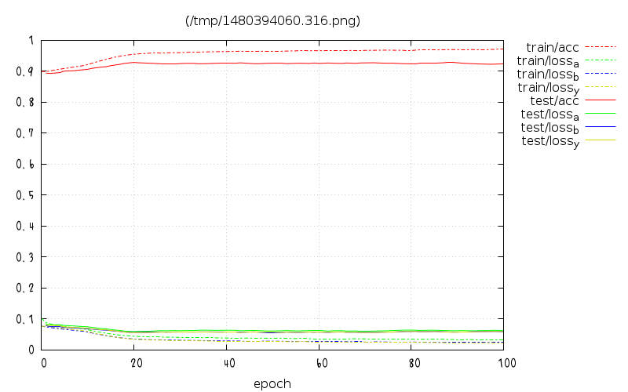

# Chainerboard

## Requirements

- Ruby
    - only with standard library
- gnuplot _5.0_
    - using terminal _pngcairo_

## Usage

```bash
chainerboard --log /path/to/chainer/result/log [ --port 20080 ]
```

and access `localhost:20080/`.

`Chainerboard` generates like this:



## LogReport format

```json
[
  {
    "epoch": 0,
    "iteration": 100,
    "main/loss_l": 0.18206550180912018,
    "main/acc": 0.33833333333333326,
    "main/loss": 0.32356593012809753,
    "validation/main/loss_l": 0.16721396148204803,
    "validation/main/acc": 0.3473333333333332,
    "validation/main/loss": 0.265784353017807
  },
  {
```

## LogPlot

A HTML page `localhost:20080/` shows 2 plots,
`localhost:20080/log/epoch` and
`localhost:20080/log/iteration`.

xrange and yrange can be specified
by appending `xrange` and `yrange` query.
E.g. `?xrange=10:20&yrange=0.8:1.0`.


